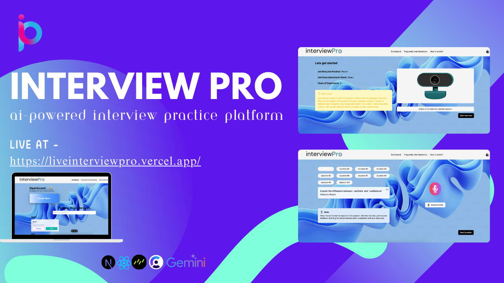
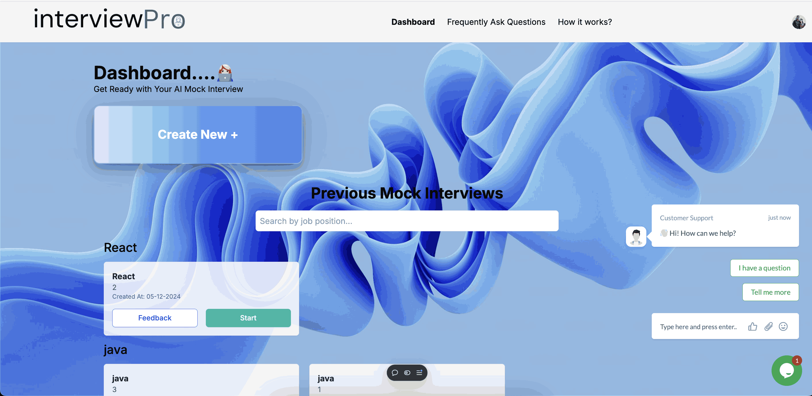
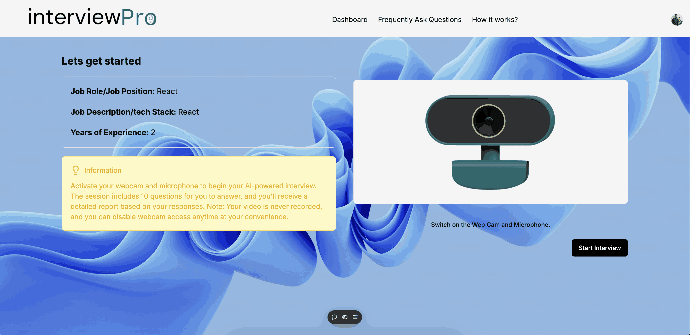
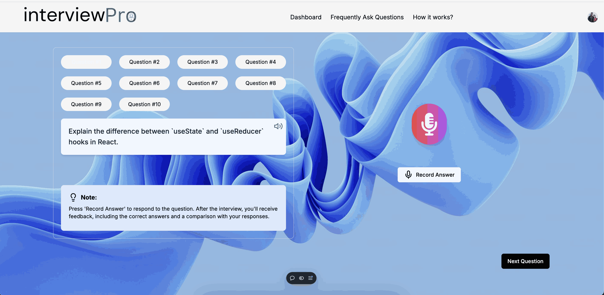

# Interview Pro: AI-Powered Interview Practice Platform

## Project Description

Welcome to the **Interview Pro**, an AI-powered platform designed to help users prepare for job interviews by simulating real interview scenarios. The system uses AI and Speech-to-Text technologies to provide real-time feedback and transcription. This platform is perfect for candidates looking to boost their confidence and enhance their communication skills across various industries and skill levels.

The Interview Mocking System is built with cutting-edge technologies such as **Next.js**, **Tailwind CSS**, and **Node.js**, integrated with advanced NLP APIs for speech-to-text transcription and real-time interview feedback.

## Preview Link

You can preview the project by visiting the live demo here:

## [Live Demo of Interview Mocking System](https://liveinterviewpro.vercel.app/)  

## Screenshot Images
  

  

  

 

## Technology Used

- **Next.js**: A powerful React framework that allows for server-side rendering and static site generation, making the platform fast and scalable.
- **Tailwind CSS**: A utility-first CSS framework that enables rapid UI design with a focus on responsive design.
- **Node.js**: A runtime environment for executing JavaScript on the server side, allowing us to handle API requests and manage data.
- **NLP APIs**: These APIs are used for real-time speech-to-text transcription and feedback generation, enhancing the mock interview experience.
- **Gemini Ai**: For Question generation and Feedback generation
- **Clerk**: This use for authenticate the login 
- **Drizzle ORM**: To store the user data in database
### Additional Technologies

- **MongoDB**: Used for storing user data and interview feedback in a scalable and efficient manner.
- **Web Speech API**: Utilized for speech recognition and speech synthesis, allowing for real-time audio processing.
  
## How to Use the Project

### Prerequisites:
- Node.js and npm installed on your machine.
- Drizzle ORM database setup for storing interview data (or use a cloud database).
- Access to NLP APIs for speech-to-text and feedback.

### Usage
- Start the mock interview session by selecting an interview type and difficulty level.
- Record your responses to interview questions using the speech-to-text functionality.
- Receive real-time feedback on your performance, including text transcription and tips for improvement.
- Review and save your session feedback for future reference.


### Installation Steps:

1. Clone this repository to your local machine:
   ```bash
   git clone https://github.com/yourusername/interviewpro.git

2. Navigate to the project directory:
   ```bash
   cd interviewpro

3. Install the dependencies:
    ```bash
    npm install
    
4. Start the development server:
    ```bash
    npm run dev          


### Environment Variables
    
    NEXT_PUBLIC_CLERK_PUBLISHABLE_KEY= <enteryourkey>
    NEXT_PUBLIC_QUESTION_NOTE=<add description according to you>
    CLERK_SECRET_KEY=<enteryourkey>
    NEXT_PUBLIC_CLERK_SIGN_IN_URL=/sign-in
    NEXT_PUBLIC_CLERK_SIGN_UP_URL=/sign-up
    NEXT_PUBLIC_DRIZZLE_DB_URL=<enteryourkey>
    NEXT_PUBLIC_GEMINI_API_KEY=<enteryourkey>
    NEXT_PUBLIC_INTERVIEW_QUESTION_COUNT=<set the value according to you>
    NEXT_PUBLIC_INFORMATION=<add description according to you>


### Team   
- Vishal Golhar - [Linkedin](https://www.linkedin.com/in/vishalgolhar/) --  [Github](https://github.com/mrvishalg2004) 

- Punam Channe - [Linkedin](https://www.linkedin.com/in/punamchanne51/) --  [Github](https://github.com/punamchanne) 

- Pranay Sangolkar- [Linkedin](https://www.linkedin.com/in/pranay-sangolkar-ab52782ab/) --  [Github](https://github.com/the-pranay) 


### Copyright Information

This project is licensed under the MIT License - see the LICENSE file for details.

© 2024 Vishal Golhar. All rights reserved..